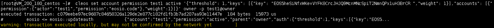

# 零 目标

1.完成课堂里面前两个需求

《1 系统发放任务并定义任务奖励

《2 员工抵押代币认领任务


2.用户提交任务并且根据任务是否到截止日期获得相应奖励。到了截止日期获得奖励为0并且之前抵押的代币不归还；不到截止日期，归还之前抵押代币并且获得相应token奖励。

即：用户首先需要认领任务， 然后提交任务到合约， 合约根据提交日期判断需要发放给用户多少token奖励。（同学们需要自己完成这个步骤。）


# 一 编写合约

```
#include <eosiolib/eosio.hpp>
#include <eosiolib/print.hpp>
#include <eosiolib/asset.hpp>
#include <eosiolib/action.hpp>
#include <eosiolib/symbol.hpp>
#include <eosiolib/singleton.hpp>
#include <eosiolib/print.hpp>
#include <eosiolib/transaction.hpp>
#include <eosiolib/crypto.h>
#include <eosiolib/dispatcher.hpp>

using namespace eosio;
using namespace std;

class [[eosio::contract]] kpigame : public contract{
public:
    using contract::contract;
    [[eosio::action]]
    void hi(name user){
        print("game start");
        require_auth(_self);
        auto values=user.value;
        print("hello user value:", values);
        print(",:hello,:", user);

        action(permission_level{_self, name("active")},
        name("eosio.token"), name("transfer"),
        std::make_tuple(_self, user, asset(1, symbol("EOS", 4)),
        std::string("game send eos")) ).send();
    }

    [[eosio::action]]
    void transfer(name from, name to, asset quantity, string memo) {
        //转账并领取任务
        //print("transfer from ", from);
        string::size_type idx;
        idx = memo.find("taskid:" );
        if(idx != string::npos){
            string id = memo.substr(memo.find("taskid:") + 7, memo.length());
            //print("  id: ", id.c_str());
            auto nID = atoi(id.c_str());
            print("  id: ", nID);

            task_index tasks(_self, _self.value);

            auto taskitem = tasks.find(nID);
            if(taskitem != tasks.end()){
                print("task find! ");
                asset pay = taskitem->reward;
                eosio_assert(quantity.amount >= pay.amount, "transfer error not enough!");

                taskuser_index tasku(_self, from.value);
                auto taskUserItem = tasku.find(taskitem->id);
                if(taskUserItem==tasku.end()){
                    print("taskuser item not  find, new one! ");
                    tasku.emplace(_self, [&](auto &t){
                        t.taskid = taskitem->id;
                        t.is_end = 0;
                        t.start_time = current_time();
                        t.reward = quantity;
                    });
                }
            }
        }
    }

    // [[eosio::action]]
    // void kpi(name from, int score){
    //     action(permission_level{_self, name("active")},
    //     name("eosio.token"), name("transfer"),
    //     std::make_tuple(_self, from, asset(score * 10 * 10000, symbol("EOS", 4)),
    //     std::string("game send eos")) ).send();

    //     work_index works(_self, _self.value);
    //     works.emplace(_self, [&](auto& work){
    //         work.id = works.available_primary_key();
    //         work.worker = from;
    //         work.phone = 0;
    //         work.score = score;
    //         work.token = asset(score * 10 * 10000, symbol("EOS", 4));
    //     });        
    // }

    [[eosio::action]]
    void addtask(string content, uint32_t level, uint64_t end, asset token){
        require_auth(_self);
        task_index tasks(_self, _self.value);

        tasks.emplace(_self, [&](auto &t){
            t.id = tasks.available_primary_key();
            t.level = level;
            t.content = content;
            t.end_time = end;
            t.reward = token;
        });

    }
    [[eosio::action]]
    void cleartask()
    {
        require_auth(_self);
        task_index st(_self, _self.value);
        auto itr = st.begin();
        while(itr != st.end()){
            itr = st.erase(itr);
        }
    }

    [[eosio::action]]
    void confirmtask(uint64_t id, name from){
      require_auth(from);

      task_index tasks(_self, _self.value);

      auto taskitem = tasks.find(id);
      if(taskitem != tasks.end()) {
        taskuser_index tasku(_self, from.value);
        auto taskUserItem = tasku.find(taskitem->id);
        if(taskUserItem!=tasku.end()){            

            tasku.modify(taskUserItem, _self, [&](auto &t){
                t.is_end = 1;
                t.end_time = current_time();
            });
        }

        if ( taskUserItem->end_time <= taskitem->end_time) {            
            //奖励
            action(permission_level{_self, name("active")},
            name("eosio.token"), name("transfer"),
            std::make_tuple(_self, from,  taskitem->reward,
            std::string("reward send eos")) ).send();

            //押金
            action(permission_level{_self, name("active")},
            name("eosio.token"), name("transfer"),
            std::make_tuple(_self, from,  taskUserItem->reward,
            std::string(" mortgage send eos")) ).send();
        }
      }
    }

    struct [[eosio::table]] work{
        uint64_t id;
        name worker;
        uint64_t phone;
        asset token;
        uint64_t score;
        uint64_t creat_time = current_time();

        uint64_t primary_key() const {return id;}

        //二级索引
        uint64_t get_phone() const{return phone;}

        //序列号数据
        EOSLIB_SERIALIZE(work, (id)(worker)(phone)(token)(score)(creat_time))
    };
    //实例化
    typedef eosio::multi_index<"work"_n, work,
    indexed_by<"phone"_n, const_mem_fun<work, uint64_t, &work::get_phone>>> work_index;
    


    struct [[eosio::table]] task{
        uint64_t id;
        string content;
        uint32_t level;
        uint64_t end_time;
        asset reward = asset(0, symbol("EOS", 4));

        uint64_t primary_key() const {return id;}
        EOSLIB_SERIALIZE(task, (id)(content)(level)(end_time)(reward))
    };
    typedef eosio::multi_index<"task"_n, task> task_index;

    struct [[eosio::table]] taskuser{
        uint64_t taskid;
        uint32_t is_end;//0 not finish   1 finished
        uint64_t start_time;//take task time
        uint64_t end_time; //upload confirmtask time
        asset reward = asset(0, symbol("EOS", 4));

        uint64_t primary_key() const {return taskid;};
        EOSLIB_SERIALIZE(taskuser, (taskid)(is_end)(start_time)(end_time)(reward))
    };
    typedef eosio::multi_index<"taskuser"_n, taskuser> taskuser_index;


};


#define EOSIO_DISPATCH_CUSTOM(TYPE, MEMBERS) \
extern "C" { \
   void apply( uint64_t receiver, uint64_t code, uint64_t action ) { \
   auto self = receiver; \
      if(( code == self&&action != name("transfer").value) || code == name("eosio.token").value && action == name("transfer").value) { \
        switch( action ) { \
            EOSIO_DISPATCH_HELPER( TYPE, MEMBERS ) \
         } \
         /* does not allow destructor of this contract to run: eosio_exit(0); */ \
      } \
   } \
} \

EOSIO_DISPATCH_CUSTOM(kpigame, (hi)(transfer)(addtask)(cleartask)(confirmtask))
```


# 二 编译合约

eosio-cpp -I include -o kpigame.wasm kpigame.cpp -abigen


# 三 部署合约

cleos set contract test1 /contract/eosio.contracts/kpigame/ -p test1@active


# 四 管理员新建任务

cleos push action test1 addtask '["task game1", 1, "1550757921", "1.0000 EOS"]' -p test1


cleos push action test1 addtask '["task game2", 1, "1550757921", "2.0000 EOS"]' -p test1


查看前端当前任务列表


# 五 测试用户领取任务

1 点击一条任务，弹出任务详情


2 点击“领取”，弹出授权页面


3 点击“Allow”, 提示领取任务成功


4 查看任务用户表详情

 cleos get table test1 mygame  taskuser


注意，如果提示transaction took too long，修改config.ini

```
max-transaction-time=1000
```


#六 测试用户提交任务

1 给合约内联转账授权

 cleos set account permission test1 active '{"threshold": 1,"keys": [{"key": "EOS5heSiNfxWKevVYFK8CrcJHJQ9McnMNcSpiT2NmnQPx1uH3BrCR ","weight": 1}],"accounts": [{"permission":{"actor":"test1","permission":"eosio.code"},"weight":1}]}' owner -p test1@owner




2查看mygame余额

cleos get currency balance eosio.token mygame EOS


3 点击一条任务，弹出任务详情


4 点击“提交任务”，弹出授权页面


5 点击“Allow”,弹出提交任务完成


6 查看任务状态

cleos get table test1 mygame  taskuser


7 查看mygame余额（增加了2个EOS， 1个是任务奖励，一个是押金）

