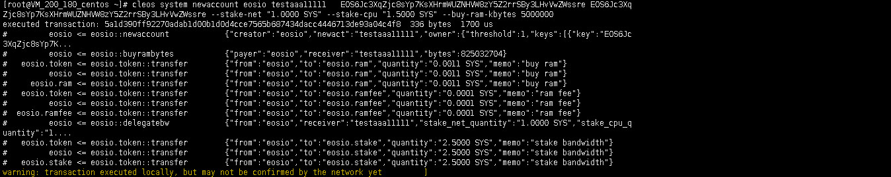
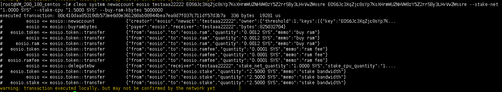
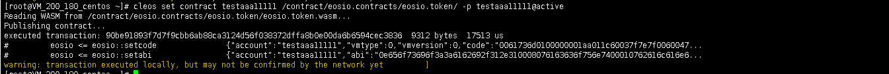
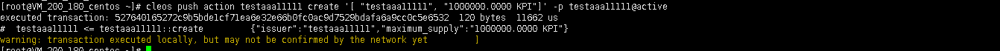
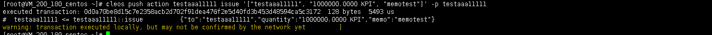
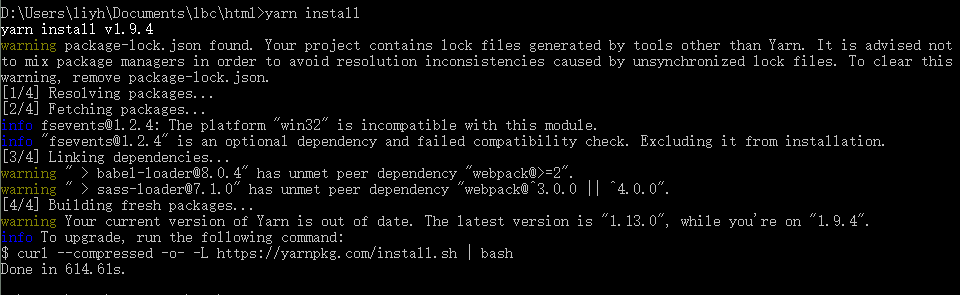
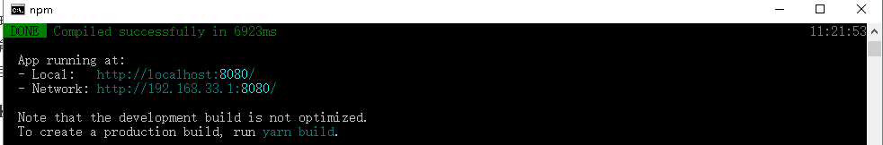
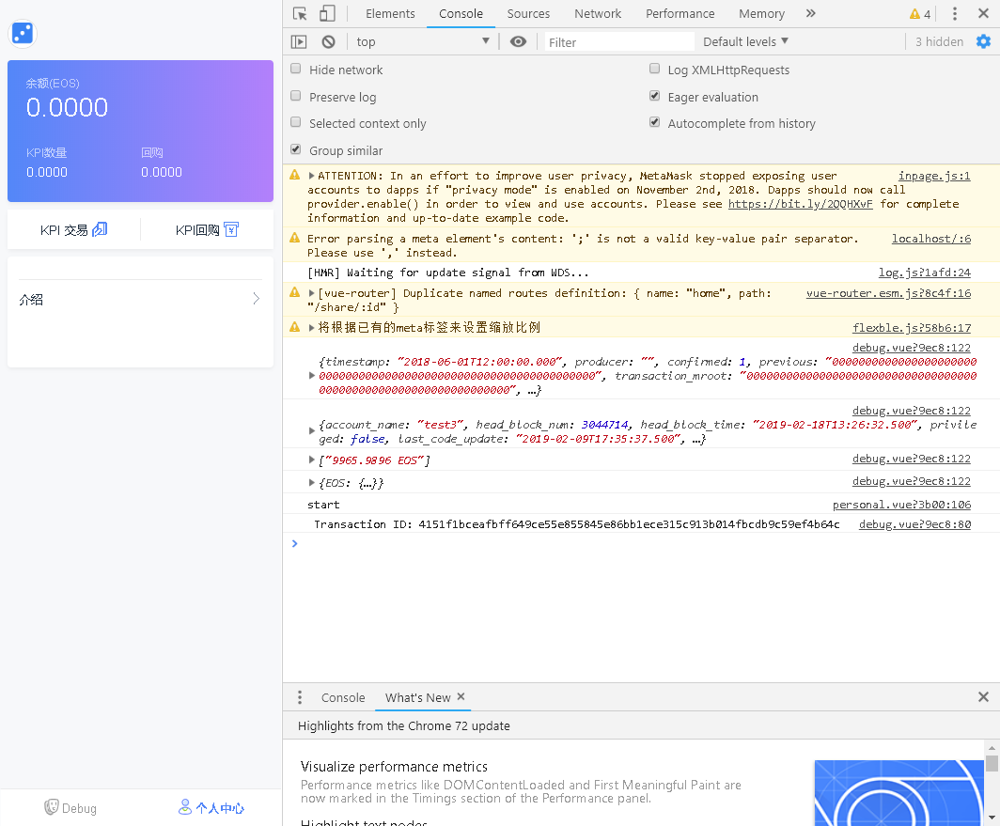

# 零 目标

创建账户testaaa11111 ，发布eosio.token到 testaaa11111账户，并且发行代币KPI，发行数量100万。

创建账户：testaaa22222。

下载前端代码 地址：<https://github.com/wangzheng2006/lbc.git>

运行html里面demo，demo运行前提 安装node.js环境，安装yarn包管理工具。

# 一 创建账户 testaaa11111  testaaa22222

cleos system newaccount eosio testaaa11111   EOS6Jc3XqZjc8sYp7KsXHrmWUZNHVW8zY5Z2rrSBy3LHvVwZWssre EOS6Jc3XqZjc8sYp7KsXHrmWUZNHVW8zY5Z2rrSBy3LHvVwZWssre --stake-net "1.0000 SYS" --stake-cpu "1.5000 SYS" --buy-ram-kbytes 5000000

cleos system newaccount eosio testaaa22222 EOS6Jc3XqZjc8sYp7KsXHrmWUZNHVW8zY5Z2rrSBy3LHvVwZWssre EOS6Jc3XqZjc8sYp7KsXHrmWUZNHVW8zY5Z2rrSBy3LHvVwZWssre --stake-net "1.0000 SYS" --stake-cpu "1.5000 SYS" --buy-ram-kbytes 5000000

# 二 部署eosio.token合约到testaaa11111

cleos set contract testaaa11111 /contract/eosio.contracts/eosio.token/ -p testaaa11111@active

# 三 创建KPI代币

cleos push action testaaa11111 create '[ "testaaa11111", "1000000.0000 KPI"]' -p testaaa11111@active

# 四 发行KPI代币100万到testaaa11111账户

cleos push action testaaa11111 issue '["testaaa11111", "1000000.0000 KPI", "memotest"]' -p testaaa11111

# 五 下载damo

git clone https://github.com/wangzheng2006/lbc.git

# 六 安装demo依赖库

cd html

yarn install

# 七 运行damo

npm run serve

chrome浏览器打开 http://localhost:8080/

# 

