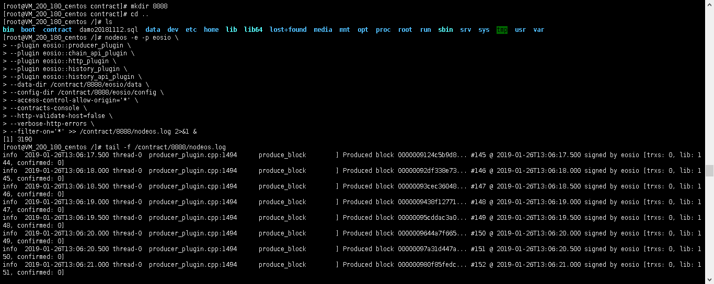
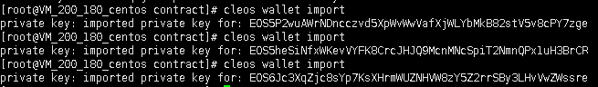
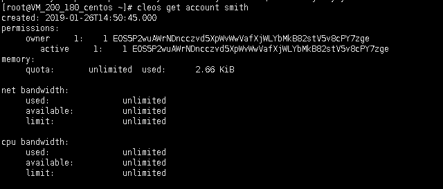

操作系统 centeros 7.5 64

# 零 目标和要求

1.搭建自己的节点

如果没有条件的可以使用EOS 的麒麟测试网。

测试网地址：[https://api-kylin.eosasia.one](https://api-kylin.eosasia.one/)

2.创建自己的账户

搭建测试网络的同学请创建系统账户，创建系统账户之前请创建系统token：SYS、EOS到eosio.token下

系统账户：eosio.stake、eosio.saving、eosio.ramfee、eosio.ram、eosio.names

eosio.msig、eosio.bpay 、eosio.vpay 

使用EOS的system合约创建账户，并且分配RAM，CPU资源。

3.创建自己的token，token名称、数量可以自己定义，并且尝试向其他账户转账。

作业提交请提交截图或者节点地址和账户名称验证。

# 一 下载程序

1 下载eos应用程序安装包
```
wget https://github.com/eosio/eos/releases/download/v1.5.0/eosio-1.5.0-1.el7.x86_64.rpm
```


2 下载cdt开发套件安装包
```
wget https://github.com/EOSIO/eosio.cdt/releases/download/v1.4.1/eosio.cdt-centos-1.4.1.x86_64-0.x86_64.rpm
```

eos应用程序安装包包含以下程序

nodeos 
cleos 
keosd 


cdt开发套件安装包

- eosio-cpp
- eosio-cc
- eosio-ld
- eosio-init
- eosio-abigen
- eosio-abidiff
- eosio-pp (post processing pass for WASM, automatically runs with eosio-cpp and eosio-ld)
- eosio-wasm2wast
- eosio-wast2wasm
- eosio-ranlib
- eosio-ar
- eosio-objdump
- eosio-readelf

# 二 安装程序
```
sudo yum install ./eosio-1.5.0-1.el7.x86_64.rpm

sudo yum install ./eosio.cdt-centos-1.4.1.x86_64-0.x86_64.rpm
```

# 三 运行节点

```
$mkdir /contract

$cd contract

$mkdir 8888

[root@VM_200_180_centos ~]# nodeos -e -p eosio \
--plugin eosio::producer_plugin \
--plugin eosio::chain_api_plugin \
--plugin eosio::http_plugin \
--plugin eosio::history_plugin \
--plugin eosio::history_api_plugin \
--data-dir /contract/8888/eosio/data \
--config-dir /contract/8888/eosio/config \
--access-control-allow-origin='*' \
--contracts-console \
--http-validate-host=false \
--verbose-http-errors \
--filter-on='*' >> /contract/8888/nodeos.log 2>&1 &

[1] 2959
```



外网的api访问

修改/contract/8888/eosio/config/config.ini 路径的http-server-address监听地址
http-server-address = 127.0.0.1:8888 为 http-server-address = 0.0.0.0:8888  


重启nodeos进程

```
pkill nodeos

nodeos -e -p eosio \
--plugin eosio::producer_plugin \
--plugin eosio::chain_api_plugin \
--plugin eosio::http_plugin \
--plugin eosio::history_plugin \
--plugin eosio::history_api_plugin \
--data-dir /contract/8888/eosio/data \
--config-dir /contract/8888/eosio/config \
--access-control-allow-origin='*' \
--contracts-console \
--http-validate-host=false \
--verbose-http-errors \
--filter-on='*' >> /contract/8888/nodeos.log 2>&1 &
```


访问 139.199.183.236 rpc服务
http://139.199.183.236:8888/v1/chain/get_info


# 四 创建钱包
cleos wallet create --to-console


钱包密码为  PW5JxSJLgoDc6EVJeZgxn3LKzSCpK1gpqfCT3icXqJPYr15mwdrfA


打开钱包，并查看钱包详情

cleos wallet open


解锁钱包，并输入密码PW5JxSJLgoDc6EVJeZgxn3LKzSCpK1gpqfCT3icXqJPYr15mwdrfA

cleos wallet unlock


# 五 创建测试用户私钥

生成密钥对

```
[root@VM_200_180_centos contract]# cleos create key --to-console
Private key: 5Jf1t7R9rxvwAo6mX67UivAENYcQK4yBFbp9vA1xME7u15AcTH8
Public key: EOS5P2wuAWrNDncczvd5XpWvWwVafXjWLYbMkB82stV5v8cPY7zge

[root@VM_200_180_centos contract]# cleos create key --to-console
Private key: 5J8UTPdkj2nppZAFhSrU45SQb2oKdXU6Lg2jDw2W7evcJNHSt7J
Public key: EOS5heSiNfxWKevVYFK8CrcJHJQ9McnMNcSpiT2NmnQPx1uH3BrCR

[root@VM_200_180_centos contract]# cleos create key --to-console
Private key: 5KjvUjKiit4H5aX5r6rJCzmRDWnWXAbdKDXVKgEDqMHxSafbnsf
Public key: EOS6Jc3XqZjc8sYp7KsXHrmWUZNHVW8zY5Z2rrSBy3LHvVwZWssre

[root@VM_200_180_centos ~]#  cleos create key --to-console
Private key: 5K9eaXUXZ44nYkYWnkVeviTr84NPUwHJs7szBeAafYr5cpGdjwx
Public key: EOS5vjbKn5N5JPMQcC3V8Cn6GjLV7yFytw3tmeKKUtPe1reADDusf

[root@VM_200_180_centos ~]# cleos create key --to-console
Private key: 5JLo3CHZJeBtRQsFK59dAaQ2KGy9hf7VAfvxzHY7FpDKcFKy2mi
Public key: EOS8KgEs7G3s26jvQ7CBUZoTrpNSoLPLPoLS1EPp6v8GPx2UVGavN

```


把私钥导入钱包

导入系统eosio的私钥，私钥详情见/contract/8888/eosio/config/config.ini 


导入eosio的私钥

cleos wallet import

5K9eaXUXZ44nYkYWnkVeviTr84NPUwHJs7szBeAafYr5cpGdjwx


导入要创建的用户的私钥

cleos wallet import




# 六 创建用户

 


cleos create account eosio 用户名 公钥 公钥

创建普通用户

cleos create account eosio smith EOS5P2wuAWrNDncczvd5XpWvWwVafXjWLYbMkB82stV5v8cPY7zge EOS5P2wuAWrNDncczvd5XpWvWwVafXjWLYbMkB82stV5v8cPY7zge
cleos create account eosio test1 EOS5heSiNfxWKevVYFK8CrcJHJQ9McnMNcSpiT2NmnQPx1uH3BrCR EOS5heSiNfxWKevVYFK8CrcJHJQ9McnMNcSpiT2NmnQPx1uH3BrCR
cleos create account eosio test2 EOS6Jc3XqZjc8sYp7KsXHrmWUZNHVW8zY5Z2rrSBy3LHvVwZWssre EOS6Jc3XqZjc8sYp7KsXHrmWUZNHVW8zY5Z2rrSBy3LHvVwZWssre


创建系统账户

cleos create account eosio eosio.token EOS5vjbKn5N5JPMQcC3V8Cn6GjLV7yFytw3tmeKKUtPe1reADDusf EOS5vjbKn5N5JPMQcC3V8Cn6GjLV7yFytw3tmeKKUtPe1reADDusf


cleos create account eosio  eosio.stake  EOS5vjbKn5N5JPMQcC3V8Cn6GjLV7yFytw3tmeKKUtPe1reADDusf EOS5vjbKn5N5JPMQcC3V8Cn6GjLV7yFytw3tmeKKUtPe1reADDusf
cleos create account eosio  eosio.saving  EOS5vjbKn5N5JPMQcC3V8Cn6GjLV7yFytw3tmeKKUtPe1reADDusf EOS5vjbKn5N5JPMQcC3V8Cn6GjLV7yFytw3tmeKKUtPe1reADDusf
cleos create account eosio  eosio.ramfee  EOS5vjbKn5N5JPMQcC3V8Cn6GjLV7yFytw3tmeKKUtPe1reADDusf EOS5vjbKn5N5JPMQcC3V8Cn6GjLV7yFytw3tmeKKUtPe1reADDusf
cleos create account eosio  eosio.ram  EOS5vjbKn5N5JPMQcC3V8Cn6GjLV7yFytw3tmeKKUtPe1reADDusf EOS5vjbKn5N5JPMQcC3V8Cn6GjLV7yFytw3tmeKKUtPe1reADDusf
cleos create account eosio  eosio.names  EOS5vjbKn5N5JPMQcC3V8Cn6GjLV7yFytw3tmeKKUtPe1reADDusf EOS5vjbKn5N5JPMQcC3V8Cn6GjLV7yFytw3tmeKKUtPe1reADDusf
cleos create account eosio  eosio.msig  EOS5vjbKn5N5JPMQcC3V8Cn6GjLV7yFytw3tmeKKUtPe1reADDusf EOS5vjbKn5N5JPMQcC3V8Cn6GjLV7yFytw3tmeKKUtPe1reADDusf
cleos create account eosio  eosio.bpay  EOS5vjbKn5N5JPMQcC3V8Cn6GjLV7yFytw3tmeKKUtPe1reADDusf EOS5vjbKn5N5JPMQcC3V8Cn6GjLV7yFytw3tmeKKUtPe1reADDusf

cleos create account eosio  eosio.vpay  EOS5vjbKn5N5JPMQcC3V8Cn6GjLV7yFytw3tmeKKUtPe1reADDusf EOS5vjbKn5N5JPMQcC3V8Cn6GjLV7yFytw3tmeKKUtPe1reADDusf


查看smith  eosio.token的状态

cleos get account 用户名




# 七 部署代币合约

下载代币合约代码

`git clone https://github.com/EOSIO/eosio.contracts --branch v1.4.0 --single-branch`  


编译代币合约

eosio-cpp -I include -o eosio.token.wasm src/eosio.token.cpp --abigen


# 八 部署代币合约

cleos set contract eosio.token /contract/eosio.contracts/eosio.token/ -p eosio.token


#九 发创建系统货币

cleos push action eosio.token create '[ "eosio", "1000000000.0000 SYS"]' -p eosio.token@active
cleos push action eosio.token create '[ "eosio", "1000000000.0000 EOS"]' -p eosio.token@active


发行系统代币给eosio

cleos push action eosio.token issue '["eosio", "10000.0000 SYS", "memotest"]'  -p eosio

cleos push action eosio.token issue '["eosio", "10000.0000 EOS", "memotest"]'  -p eosio


# 十 创建自定义货币（ put action 也用smith 权限用smith@action）

部署

cleos set contract smith /contract/eosio.contracts/eosio.token/ -p smith@active


创建

cleos push action smith create '[ "smith", "1000000000.0000 XRP"]' -p smith@active


发行

cleos push action smith issue '["test1", "900.0000 XRP", "memotest"]'  -p smith


转账

cleos push action smith transfer '[ "test1", "test2", "25.0000 XRP", "memotest" ]' -p test1@active


查询余额

cleos get currency balance eosio.token smith XRP

cleos get currency balance eosio.token test1 XRP

cleos get currency balance eosio.token test2 XRP


# 十一 编译eos.system，申请账户分配资源

参考 https://developers.eos.io/eosio-nodeos/docs/bios-boot-sequence

1 把eosio.contracts/eosio.token/include/eosio.token/文件夹拷贝到

 /eosio.contracts/eosio.system/include下


2 回到eosio.system合约目录

cd /eosio.contracts/eosio.system/


编译

3 eosio-cpp -I include -o eosio.system.wasm src/eosio.system.cpp --abigen


部署eos.system合约

cleos set contract eosio /contract/eosio.contracts/eosio.system/ -p eosio@active


初始化eos.system合约

cleos push action eosio init '["0", "4,SYS"]' -p eosio@active


创建账户并分配资源

 cleos system newaccount eosio testaaa55555 EOS6GQa2Nhiryv6NvrjVgbctuH5meD2ckGXUQzhtavptK4qjhSsVF EOS6GQa2Nhiryv6NvrjVgbctuH5meD2ckGXUQzhtavptK4qjhSsVF --stake-net "1000000.0000 SYS" --stake-cpu "1000000.5000 SYS" --buy-ram-kbytes 5000000


注意：如提示assertion failure with message: must purchase a positive amount，把--buy-ram-kbytes的参数调大即可


cleos get account testaaa55555

