# 零 目标

1.创建一个合约数据库表可以自定义存储内容，使用主键自增，增加数据观察RAM消耗，删除数据观察RAM消耗。
2.创建合约 action==kpi
实现功能：
《1 记录本次用户的KPI得分，并且发放相应TOKEN奖励到用户账户并记录下奖励TOKEN数量。
《2 分值和token获得数量比例为1比10，获得1分kpi得分就会获取10 EOStoken。
即每次执行方法记录用户信息、用户KPI得分、用户获取token数量信息。
《3 并且使用RPC接口查询数据。
《4 主键自增。

存储的结构体信息如下：

```
struct [[eosio::table]] work{
   uint64_t id;
   name worker;
   asset token;
   uint64_t score;
   uint64_t creat_time= current_time();
   //主键
   uint64_t primary_key() const {  return id; }


   //序列化数据。
   EOSLIB_SERIALIZE( work, (id)(worker)(token)(score)(creat_time))
};
```

思考题：怎么减少RAM资源消耗的使用。


# 一 编写合约

```
#include <eosiolib/eosio.hpp>
#include <eosiolib/print.hpp>
#include <eosiolib/asset.hpp>
#include <eosiolib/action.hpp>
#include <eosiolib/symbol.hpp>
#include <eosiolib/singleton.hpp>
#include <eosiolib/print.hpp>
#include <eosiolib/transaction.hpp>
#include <eosiolib/crypto.h>
#include <eosiolib/dispatcher.hpp>

using namespace eosio;
using namespace std;

class [[eosio::contract]] hello : public contract{
public:
    using contract::contract;

    [[eosio::action]]
    void hi(name user){
        print("game start");
        require_auth(_self);
        auto values=user.value;
        print("hello user value:", values);
        print(",:hello,:", user);

        action(permission_level{_self, name("active")},
        name("eosio.token"), name("transfer"),
        std::make_tuple(_self, user, asset(1, symbol("EOS", 4)),
        std::string("game send eos")) ).send();
    }

    [[eosio::action]]
    void delay(string memeo){
        eosio::transaction t{};
        t.actions.emplace_back(eosio::permission_level(_self, name("active")),
            name("test1"), name("hi"),
            std::make_tuple(name("test2"))
        );
        t.delay_sec = 1;
        t.send(1, _self, false);
        print("delay end!");
    }


    [[eosio::action]]
    void add(name from, uint64_t phone){
        work_index works(_self, _self.value);

        works.emplace(_self, [&](auto& work){
            work.id = works.available_primary_key();
            work.worker = from;
            work.phone = phone;
            work.token = asset(0, symbol("EOS", 4));
        });
    }

    [[eosio::action]]
    void update(uint64_t id, uint64_t phone){
        work_index works(_self, _self.value);

        auto item = works.find(id);
        works.modify(item, _self, [&](auto & work){
            work.phone = phone;
        });
    }

    [[eosio::action]]
    void del(uint64_t id){
        work_index works(_self, _self.value);

        auto item = works.find(id);
        works.erase(item);
    }

    [[eosio::action]]
    void query(uint64_t phone){
        work_index works(_self, _self.value);
        auto workitem = works.get_index<"phone"_n>();
        auto item = workitem.find(phone);
        print("query name is:", item->worker);
    }

    [[eosio::action]]
    void kpi(name from, int score){
        action(permission_level{_self, name("active")},
        name("eosio.token"), name("transfer"),
        std::make_tuple(_self, from, asset(score * 10 * 10000, symbol("EOS", 4)),
        std::string("game send eos")) ).send();

        work_index works(_self, _self.value);
        works.emplace(_self, [&](auto& work){
            work.id = works.available_primary_key();
            work.worker = from;
            work.phone = 0;
            work.score = score;
            work.token = asset(score * 10 * 10000, symbol("EOS", 4));
        });        
    } 

    [[eosio::action]]
    void studentadd(int age){
        student_index students(_self, _self.value);

        students.emplace(_self, [&](auto& stu){
            stu.id = students.available_primary_key();
            stu.age = age;
        });      
    }
    [[eosio::action]]
    void studentdel(int64_t id){
        student_index students(_self, _self.value);

        auto item = students.find(id);
        students.erase(item);
    }

    struct [[eosio::table]] work{
        uint64_t id;
        name worker;
        uint64_t phone;
        asset token;
        uint64_t score;
        uint64_t creat_time = current_time();

        uint64_t primary_key() const {return id;}

        //二级索引
        uint64_t get_phone() const{return phone;}

        //序列号数据
        EOSLIB_SERIALIZE(work, (id)(worker)(phone)(token)(score)(creat_time))
    };
    //实例化
    typedef eosio::multi_index<"work"_n, work,
    indexed_by<"phone"_n, const_mem_fun<work, uint64_t, &work::get_phone>>> work_index;
    //work_index works(_self, _self.value);

    struct __attribute__((eosio_table)) student{
        uint64_t id;
        int age;

        uint64_t primary_key() const {return id;}
        EOSLIB_SERIALIZE(student, (id)(age));
    };
    typedef eosio::multi_index<"student"_n, student> student_index;
};


#define EOSIO_DISPATCH_CUSTOM(TYPE, MEMBERS) \
extern "C" { \
   void apply( uint64_t receiver, uint64_t code, uint64_t action ) { \
   auto self = receiver; \
      if(( code == self&&action != name("transfer").value) || code == name("eosio.token").value && action == name("transfer").value) { \
        switch( action ) { \
            EOSIO_DISPATCH_HELPER( TYPE, MEMBERS ) \
         } \
         /* does not allow destructor of this contract to run: eosio_exit(0); */ \
      } \
   } \
} \

EOSIO_DISPATCH_CUSTOM(hello, (hi)(delay)(add)(update)(del)(query)(kpi)(studentadd)(studentdel))
```


# 二 编译合约

eosio-cpp -I include -o hello.wasm hello.cpp -abigen

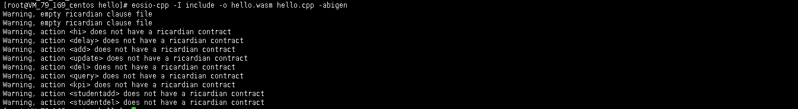

# 三 部署合约

cleos set contract mygame /contract/eosio.contracts/hello/ -p mygame@active

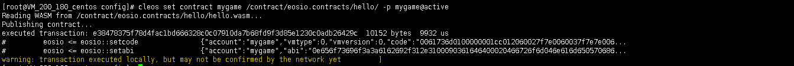

# 四 增加数据，查看用户的RAM消耗

cleos get account mygame


cleos push action mygame studentadd '[1]' -p mygame

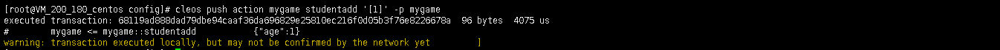


cleos get account mygame

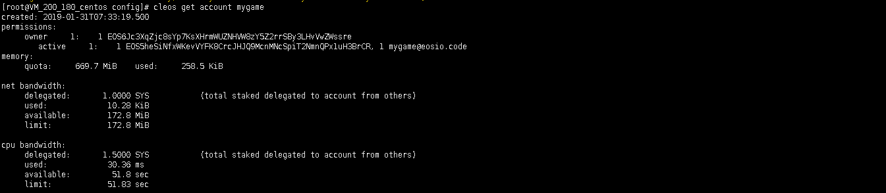

发行memory使用多了0.1kib


postman查看当前的记录（cleos get table mygame mygame student命令也可）

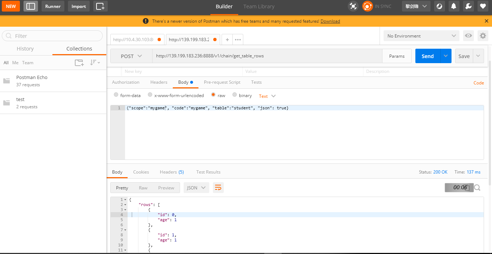

# 五 执行删除数据，查看用户的RAM消耗

删除前

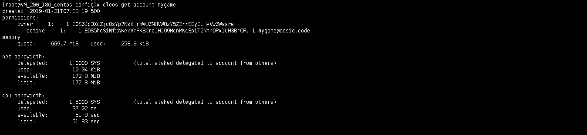


cleos push action mygame studentdel '[0]' -p mygame


删除后

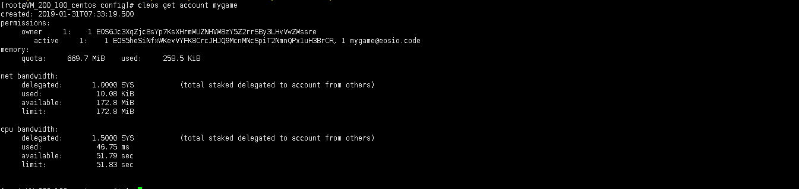


memory占用，少了0.1Kib

# 六 执行kpi的action

1 记给smith 1个kpi

cleos push action mygame kpi '["smith", 1]' -p mygame

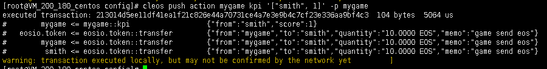

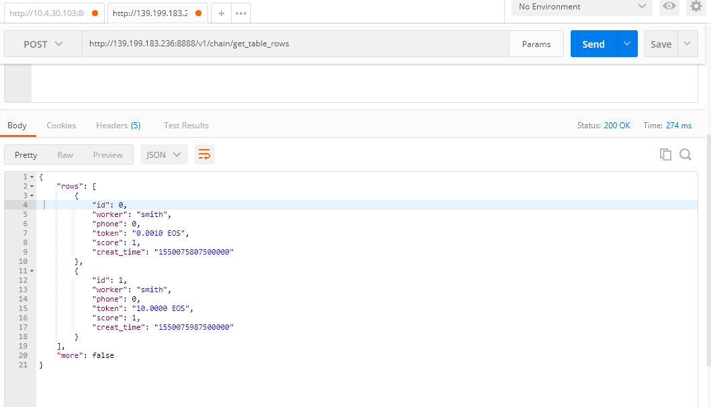


2  记给test1 2个kpi

cleos push action mygame kpi '["test1", 2]' -p mygame

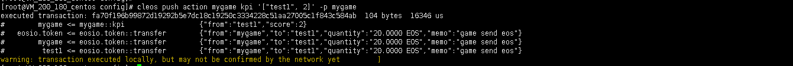

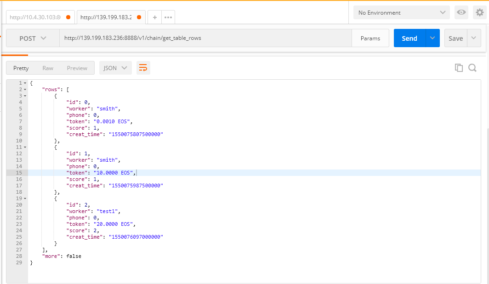


六 怎么减少RAM资源消耗的使用

1 业务设计，减少数据上链

2 table上的数据，使用尽可能短的数据类型

3 不使用table，把数据保持在交易数据中

4 table使用EOSLIB_SERIALIZE序列化成员变量