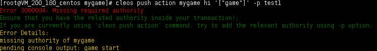

零 目标

1.创建一个叫game的用户。

2.写一个游戏合约把第一课自己创建的token通过游戏合约转账给game用户。

3.游戏合约只能由特定的用户调用转账。


# 一 创建游戏合约用户

cleos system newaccount eosio mygame EOS6Jc3XqZjc8sYp7KsXHrmWUZNHVW8zY5Z2rrSBy3LHvVwZWssre EOS6Jc3XqZjc8sYp7KsXHrmWUZNHVW8zY5Z2rrSBy3LHvVwZWssre --stake-net "1.0000 SYS" --stake-cpu "1.5000 SYS" --buy-ram-kbytes 5000000


# 二 创建game玩家用户

cleos system newaccount eosio game EOS6Jc3XqZjc8sYp7KsXHrmWUZNHVW8zY5Z2rrSBy3LHvVwZWssre EOS6Jc3XqZjc8sYp7KsXHrmWUZNHVW8zY5Z2rrSBy3LHvVwZWssre --stake-net "1.0000 SYS" --stake-cpu "1.5000 SYS" --buy-ram-kbytes 5000000


# 三 编写game合约

```
#include <eosiolib/eosio.hpp>
#include <eosiolib/print.hpp>
#include <eosiolib/asset.hpp>
#include <eosiolib/action.hpp>
#include <eosiolib/symbol.hpp>
#include <eosiolib/singleton.hpp>
#include <eosiolib/print.hpp>
#include <eosiolib/transaction.hpp>
#include <eosiolib/crypto.h>
#include <eosiolib/dispatcher.hpp>

using namespace eosio;
using namespace std;

class mygame : public contract{
public:
    using contract::contract;

    [[eosio::action]]
    void hi(name user){
        print("game start");
        require_auth(_self);
        auto values=user.value;
        print("hello user value:", values);
        print(",:hello,:", user);

        action(permission_level{_self, name("active")},
        name("smith"), name("transfer"),
        std::make_tuple(_self, user, asset(1, symbol("XRP", 4)),
        std::string("game send XRP")) ).send();
    }

    [[eosio::action]]
    void transfer(name from, name to, asset quantity, string memo){        
        print("transfer from ",from);
        //require_auth(permission_level{name("smith"), name("active")});
		//eosio_assert(from == name("smith")," transfer error, only smith!");
    }

    [[eosio::action]]
    void delay(string memeo){
        eosio::transaction t{};
        t.actions.emplace_back(eosio::permission_level(_self, name("active")),
            name("mygame"), name("hi"),
            std::make_tuple(name("game"))
        );
        t.delay_sec = 1;
        t.send(1, _self, false);
        print("delay end!");
    }
};


#define EOSIO_DISPATCH_CUSTOM(TYPE, MEMBERS) \
extern "C" { \
   void apply( uint64_t receiver, uint64_t code, uint64_t action ) { \
   auto self = receiver; \
      if(( code == self&&action != name("transfer").value) || code == name("smith").value && action == name("transfer").value) { \
        switch( action ) { \
            EOSIO_DISPATCH_HELPER( TYPE, MEMBERS ) \
         } \
         /* does not allow destructor of this contract to run: eosio_exit(0); */ \
      } \
   } \
} \

EOSIO_DISPATCH_CUSTOM(mygame, (hi)(delay)(transfer))
```


# 四 编译游戏合约 

eosio-cpp  -I include  -o mygame.wasm mygame.cpp -abigen


# 五 发布游戏合约

cleos set contract mygame /contract/eosio.contracts/mygame/ -p mygame@active


# 七 游戏合约内联转账授权

cleos set account permission mygame active '{"threshold": 1,"keys": [{"key": "EOS5heSiNfxWKevVYFK8CrcJHJQ9McnMNcSpiT2NmnQPx1uH3BrCR ","weight": 1}],"accounts": [{"permission":{"actor":"mygame","permission":"eosio.code"},"weight":1}]}' owner -p mygame@owner


# 八 给测试账户发行代币

cleos push action smith issue '["smith", "900.0000 XRP", "memotest"]' -p smith

cleos push action smith issue '["test1", "900.0000 XRP", "memotest"]' -p smith

cleos push action smith issue '["mygame", "900.0000 XRP", "memotest"]' -p smith


# 九 运行合约

1 通过mygame合约账户权限，内部转账

cleos push action mygame hi '[ "game"]' -p mygame


2 通过smith test1，非合约账户

cleos push action mygame hi '[ "game"]' -p smith


cleos push action mygame hi '[ "game"]' -p test1




3 延迟转账及require_recipient事件监听响应

cleos push action mygame delay '["memomsg"]' -p mygame

